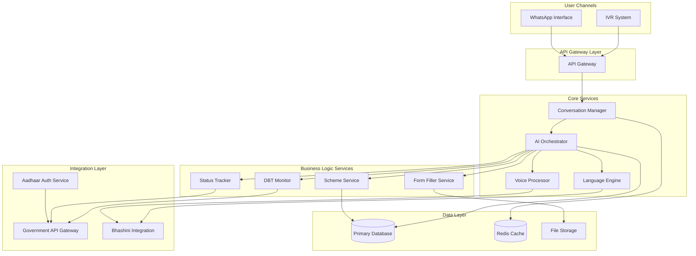

# Design Document: Rural Scheme Access System

## Overview

The Rural Scheme Access System is a voice-first, multilingual AI assistant that helps rural citizens in India access government welfare schemes. The system operates through two primary channels: WhatsApp for smartphone users and toll-free IVR for feature phone users. It addresses the critical "last-mile" gap by providing scheme discovery, eligibility checking, application assistance, status tracking, and Direct Benefit Transfer monitoring in 15+ Indian languages including local dialects.

The system architecture follows a microservices pattern with clear separation between channel interfaces, core AI processing, language services, government integrations, and data storage. This design ensures scalability, maintainability, and the ability to add new channels or schemes without disrupting existing functionality.

## Architecture

### High-Level Architecture



### Channel Layer

**WhatsApp Interface**
- Integrates with WhatsApp Business API
- Handles incoming text, voice notes, and media messages
- Sends text responses, voice messages, images, and videos
- Manages webhook callbacks for message delivery status
- Implements rate limiting per WhatsApp API guidelines

**IVR System**
- Integrates with telecom provider's IVR platform
- Handles DTMF input and voice input
- Streams audio responses using text-to-speech
- Manages call state and session persistence
- Implements call recording for quality and training purposes

### Core Services Layer

**API Gateway**
- Routes requests from channels to appropriate services
- Handles authentication and authorization
- Implements rate limiting and throttling
- Provides request/response logging
- Manages API versioning

**Conversation Manager**
- Maintains conversation state across interactions
- Stores conversation history in Redis for fast access
- Implements session timeout and cleanup
- Handles context switching between topics
- Manages multi-turn dialogue flow

**AI Orchestrator**
- Coordinates between different services to fulfill user requests
- Implements intent recognition and entity extraction
- Manages dialogue policy and response generation
- Handles fallback strategies when services fail
- Implements conversation flow logic

**Voice Processor**
- Transcribes voice input to text using Bhashini ASR
- Converts text responses to speech using Bhashini TTS
- Handles audio format conversion and compression
- Implements noise reduction and audio enhancement
- Supports streaming for real-time processing

**Language Engine**
- Detects language from user input
- Translates between languages when needed
- Recognizes local dialects and slang using custom models
- Normalizes text for processing
- Maintains language-specific conversation context

### Business Logic Layer

**Scheme Service**
- Maintains database of government schemes
- Implements eligibility checking logic
- Provides scheme recommendations based on user profile
- Generates scheme explanations in simple language
- Updates scheme information from government sources

**Form Filler Service**
- Collects required information through conversational flow
- Validates input against scheme requirements
- Generates pre-filled PDF forms
- Creates JSON payloads for API submission
- Stores draft applications for resumption

**Status Tracker**
- Queries government portals for application status
- Caches status information to reduce API calls
- Translates status codes to user-friendly messages
- Provides next-step guidance based on status
- Sends proactive notifications on status changes

**DBT Monitor**
- Retrieves Direct Benefit Transfer records from government systems
- Presents transfers in "Passbook View" format
- Calculates total benefits received
- Identifies missing or delayed payments
- Generates visual reports for WhatsApp users

### Integration Layer

**Aadhaar Auth Service**
- Implements Aadhaar OTP authentication flow
- Implements Aadhaar FaceRD authentication flow
- Integrates with UIDAI authentication APIs
- Manages authentication tokens securely
- Implements retry logic for failed authentications

**Government API Gateway**
- Integrates with UMANG platform for scheme applications
- Integrates with state-specific portals
- Implements API authentication and token management
- Handles API rate limits and quotas
- Provides fallback mechanisms when APIs are unavailable

**Bhashini Integration**
- Integrates with Bhashini ASR for speech-to-text
- Integrates with Bhashini TTS for text-to-speech
- Integrates with Bhashini NMT for translation
- Implements custom dialect models using Project Vaani datasets
- Handles API failures with graceful degradation

### Data Layer

**Primary Database (PostgreSQL)**
- Stores user profiles and authentication data
- Stores conversation history
- Stores application records
- Stores scheme information
- Implements encryption at rest

**Redis Cache**
- Caches active conversation sessions
- Caches frequently accessed scheme information
- Caches government API responses
- Implements session expiry
- Provides pub/sub for real-time updates

**File Storage (S3-compatible)**
- Stores generated PDF forms
- Stores voice recordings
- Stores visual content (infographics, videos)
- Implements lifecycle policies for data retention
- Provides signed URLs for secure access

## Components and Interfaces

### Conversation Manager

**Interface:**
```typescript
interface ConversationManager {
  // Create new conversation session
  createSession(userId: string, channel: Channel): Session
  
  // Get existing session
  getSession(sessionId: string): Session | null
  
  // Add message to conversation
  addMessage(sessionId: string, message: Message): void
  
  // Get conversation history
  getHistory(sessionId: string, limit?: number): Message[]
  
  // Update session context
  updateContext(sessionId: string, context: Context): void
  
  // End session
  endSession(sessionId: string): void
}

interface Session {
  id: string
  userId: string
  channel: Channel
  language: Language
  context: Context
  createdAt: Date
  lastActivityAt: Date
  expiresAt: Date
}

interface Message {
  id: string
  sessionId: string
  role: 'user' | 'assistant'
  content: string
  contentType: 'text' | 'voice' | 'image'
  metadata: Record<string, any>
  timestamp: Date
}

interface Context {
  currentIntent?: string
  entities: Record<string, any>
  conversationState: string
  userProfile?: UserProfile
}

enum Channel {
  WhatsApp = 'whatsapp',
  IVR = 'ivr'
}

enum Language {
  Hindi = 'hi',
  Marathi = 'mr',
  Telugu = 'te',
  Bengali = 'bn',
  Tamil = 'ta',
  Kannada = 'kn',
  Odia = 'or'
}
```

**Responsibilities:**
- Session lifecycle management
- Conversation state persistence
- Context management across turns
- Session timeout handling

### Voice Processor

**Interface:**
```typescript
interface VoiceProcessor {
  // Transcribe voice to text
  transcribe(audio: AudioBuffer, language: Language): Promise<TranscriptionResult>
  
  // Convert text to speech
  synthesize(text: string, language: Language): Promise<AudioBuffer>
  
  // Detect language from audio
  detectLanguage(audio: AudioBuffer): Promise<Language>
  
  // Enhance audio quality
  enhanceAudio(audio: AudioBuffer): Promise<AudioBuffer>
}

interface TranscriptionResult {
  text: string
  confidence: number
  language: Language
  dialect?: string
}

interface AudioBuffer {
  data: Buffer
  format: AudioFormat
  sampleRate: number
  duration: number
}

enum AudioFormat {
  WAV = 'wav',
  MP3 = 'mp3',
  OGG = 'ogg',
  OPUS = 'opus'
}
```

**Responsibilities:**
- Speech-to-text conversion
- Text-to-speech synthesis
- Audio format handling
- Language detection from audio

### Language Engine

**Interface:**
```typescript
interface LanguageEngine {
  // Detect language from text
  detectLanguage(text: string): Language
  
  // Recognize dialect
  recognizeDialect(text: string, language: Language): string | null
  
  // Normalize text (handle slang, typos)
  normalize(text: string, language: Language): string
  
  // Translate text
  translate(text: string, from: Language, to: Language): Promise<string>
  
  // Simplify text for low literacy
  simplify(text: string, language: Language): string
}
```

**Responsibilities:**
- Language detection and recognition
- Dialect handling
- Text normalization
- Translation services
- Text simplification

### Scheme Service

**Interface:**
```typescript
interface SchemeService {
  // Get all available schemes
  getAllSchemes(): Promise<Scheme[]>
  
  // Get scheme by ID
  getScheme(schemeId: string): Promise<Scheme | null>
  
  // Check eligibility
  checkEligibility(schemeId: string, userProfile: UserProfile): Promise<EligibilityResult>
  
  // Get recommended schemes
  getRecommendations(userProfile: UserProfile): Promise<Scheme[]>
  
  // Get scheme explanation
  getExplanation(schemeId: string, language: Language): Promise<string>
}

interface Scheme {
  id: string
  name: string
  nameTranslations: Record<Language, string>
  description: string
  descriptionTranslations: Record<Language, string>
  category: SchemeCategory
  eligibilityCriteria: EligibilityCriteria
  benefits: string[]
  applicationProcess: string[]
  requiredDocuments: string[]
  officialUrl: string
}

interface EligibilityCriteria {
  minAge?: number
  maxAge?: number
  gender?: 'male' | 'female' | 'any'
  occupation?: string[]
  incomeLimit?: number
  landOwnership?: boolean
  state?: string[]
  customCriteria?: Record<string, any>
}

interface EligibilityResult {
  eligible: boolean
  reasons: string[]
  missingRequirements?: string[]
}

enum SchemeCategory {
  Agriculture = 'agriculture',
  Employment = 'employment',
  Health = 'health',
  Housing = 'housing',
  Energy = 'energy',
  Pension = 'pension',
  Livelihood = 'livelihood'
}
```

**Responsibilities:**
- Scheme information management
- Eligibility checking
- Scheme recommendations
- Multilingual explanations

### Form Filler Service

**Interface:**
```typescript
interface FormFillerService {
  // Start form filling process
  startForm(schemeId: string, userId: string): Promise<FormSession>
  
  // Get next question
  getNextQuestion(formSessionId: string): Promise<FormQuestion | null>
  
  // Submit answer
  submitAnswer(formSessionId: string, answer: any): Promise<void>
  
  // Validate form
  validateForm(formSessionId: string): Promise<ValidationResult>
  
  // Generate PDF
  generatePDF(formSessionId: string): Promise<PDFDocument>
  
  // Generate JSON for API submission
  generateJSON(formSessionId: string): Promise<ApplicationPayload>
  
  // Submit application
  submitApplication(formSessionId: string): Promise<SubmissionResult>
}

interface FormSession {
  id: string
  schemeId: string
  userId: string
  collectedData: Record<string, any>
  currentStep: number
  totalSteps: number
  status: FormStatus
  createdAt: Date
  updatedAt: Date
}

interface FormQuestion {
  field: string
  question: string
  questionType: QuestionType
  required: boolean
  validation?: ValidationRule
  options?: string[]
}

enum QuestionType {
  Text = 'text',
  Number = 'number',
  Date = 'date',
  Choice = 'choice',
  MultiChoice = 'multi_choice',
  Boolean = 'boolean'
}

interface ValidationResult {
  valid: boolean
  errors: FieldError[]
}

interface FieldError {
  field: string
  message: string
}

interface PDFDocument {
  buffer: Buffer
  filename: string
  referenceCode: string
}

interface ApplicationPayload {
  schemeId: string
  applicantData: Record<string, any>
  documents: Document[]
}

interface SubmissionResult {
  success: boolean
  applicationId?: string
  referenceNumber?: string
  error?: string
}

enum FormStatus {
  InProgress = 'in_progress',
  Completed = 'completed',
  Submitted = 'submitted',
  Abandoned = 'abandoned'
}
```

**Responsibilities:**
- Form flow management
- Data collection and validation
- PDF generation
- Application submission

### Status Tracker

**Interface:**
```typescript
interface StatusTracker {
  // Track application
  trackApplication(applicationId: string, schemeId: string): Promise<ApplicationStatus>
  
  // Get user's applications
  getUserApplications(userId: string): Promise<ApplicationRecord[]>
  
  // Subscribe to status updates
  subscribeToUpdates(applicationId: string, userId: string): Promise<void>
  
  // Get status explanation
  getStatusExplanation(status: string, language: Language): string
}

interface ApplicationStatus {
  applicationId: string
  schemeId: string
  status: string
  statusCode: StatusCode
  lastUpdated: Date
  nextSteps: string[]
  estimatedCompletionDate?: Date
}

interface ApplicationRecord {
  id: string
  schemeId: string
  schemeName: string
  submittedAt: Date
  currentStatus: string
  statusHistory: StatusHistoryEntry[]
}

interface StatusHistoryEntry {
  status: string
  timestamp: Date
  notes?: string
}

enum StatusCode {
  Submitted = 'submitted',
  UnderReview = 'under_review',
  Approved = 'approved',
  Rejected = 'rejected',
  PaymentProcessing = 'payment_processing',
  Completed = 'completed'
}
```

**Responsibilities:**
- Application status retrieval
- Status change notifications
- Status explanation generation
- Application history tracking

### DBT Monitor

**Interface:**
```typescript
interface DBTMonitor {
  // Get DBT records
  getDBTRecords(aadhaarHash: string, startDate?: Date, endDate?: Date): Promise<DBTRecord[]>
  
  // Get passbook view
  getPassbookView(aadhaarHash: string): Promise<PassbookView>
  
  // Get total benefits
  getTotalBenefits(aadhaarHash: string, schemeId?: string): Promise<BenefitSummary>
  
  // Check for missing payments
  checkMissingPayments(aadhaarHash: string, schemeId: string): Promise<MissingPayment[]>
}

interface DBTRecord {
  transactionId: string
  schemeId: string
  schemeName: string
  amount: number
  transferDate: Date
  bankAccount: string
  status: TransferStatus
}

interface PassbookView {
  totalTransfers: number
  totalAmount: number
  records: DBTRecord[]
  lastUpdated: Date
}

interface BenefitSummary {
  totalAmount: number
  transferCount: number
  schemeBreakdown: SchemeBreakdown[]
}

interface SchemeBreakdown {
  schemeId: string
  schemeName: string
  amount: number
  transferCount: number
}

interface MissingPayment {
  expectedDate: Date
  amount: number
  reason: string
}

enum TransferStatus {
  Pending = 'pending',
  Completed = 'completed',
  Failed = 'failed',
  Reversed = 'reversed'
}
```

**Responsibilities:**
- DBT record retrieval
- Passbook generation
- Benefit calculation
- Missing payment detection

### Aadhaar Auth Service

**Interface:**
```typescript
interface AadhaarAuthService {
  // Initiate OTP authentication
  initiateOTPAuth(aadhaarNumber: string): Promise<OTPSession>
  
  // Verify OTP
  verifyOTP(sessionId: string, otp: string): Promise<AuthResult>
  
  // Initiate Face authentication
  initiateFaceAuth(aadhaarNumber: string): Promise<FaceSession>
  
  // Verify Face
  verifyFace(sessionId: string, faceImage: Buffer): Promise<AuthResult>
  
  // Get authentication status
  getAuthStatus(sessionId: string): Promise<AuthStatus>
}

interface OTPSession {
  sessionId: string
  expiresAt: Date
  attemptsRemaining: number
}

interface FaceSession {
  sessionId: string
  expiresAt: Date
  attemptsRemaining: number
}

interface AuthResult {
  success: boolean
  aadhaarHash: string
  name?: string
  error?: string
  errorCode?: string
}

interface AuthStatus {
  sessionId: string
  authenticated: boolean
  expiresAt: Date
}
```

**Responsibilities:**
- Aadhaar OTP authentication
- Aadhaar Face authentication
- Session management
- UIDAI API integration

## Data Models

### User Profile

```typescript
interface UserProfile {
  id: string
  aadhaarHash: string
  phoneNumber: string
  name?: string
  age?: number
  gender?: 'male' | 'female' | 'other'
  state?: string
  district?: string
  village?: string
  occupation?: string
  landOwnership?: boolean
  annualIncome?: number
  preferredLanguage: Language
  preferredChannel: Channel
  createdAt: Date
  updatedAt: Date
  lastActiveAt: Date
}
```

### Conversation Record

```typescript
interface ConversationRecord {
  id: string
  userId: string
  sessionId: string
  channel: Channel
  language: Language
  messages: Message[]
  startedAt: Date
  endedAt?: Date
  completionStatus: CompletionStatus
}

enum CompletionStatus {
  Completed = 'completed',
  Abandoned = 'abandoned',
  InProgress = 'in_progress'
}
```

### Application Record

```typescript
interface ApplicationRecord {
  id: string
  userId: string
  schemeId: string
  formSessionId: string
  applicationData: Record<string, any>
  submittedAt?: Date
  submissionMethod: SubmissionMethod
  governmentApplicationId?: string
  referenceNumber?: string
  pdfUrl?: string
  currentStatus: string
  statusHistory: StatusHistoryEntry[]
  createdAt: Date
  updatedAt: Date
}

enum SubmissionMethod {
  DirectAPI = 'direct_api',
  CSC = 'csc',
  Manual = 'manual'
}
```

### Scheme Record

```typescript
interface SchemeRecord {
  id: string
  code: string
  name: string
  nameTranslations: Record<Language, string>
  description: string
  descriptionTranslations: Record<Language, string>
  category: SchemeCategory
  eligibilityCriteria: EligibilityCriteria
  benefits: string[]
  benefitTranslations: Record<Language, string[]>
  applicationProcess: string[]
  requiredDocuments: string[]
  officialUrl: string
  apiEndpoint?: string
  active: boolean
  createdAt: Date
  updatedAt: Date
}
```

### Analytics Event

```typescript
interface AnalyticsEvent {
  id: string
  eventType: EventType
  userId?: string
  sessionId?: string
  channel: Channel
  language: Language
  metadata: Record<string, any>
  timestamp: Date
}

enum EventType {
  SessionStarted = 'session_started',
  SessionEnded = 'session_ended',
  SchemeQueried = 'scheme_queried',
  EligibilityChecked = 'eligibility_checked',
  FormStarted = 'form_started',
  FormCompleted = 'form_completed',
  ApplicationSubmitted = 'application_submitted',
  StatusChecked = 'status_checked',
  DBTViewed = 'dbt_viewed',
  ErrorOccurred = 'error_occurred',
  FallbackTriggered = 'fallback_triggered'
}
```


## Correctness Properties

A property is a characteristic or behavior that should hold true across all valid executions of a system—essentially, a formal statement about what the system should do. Properties serve as the bridge between human-readable specifications and machine-verifiable correctness guarantees.

### Property Reflection

After analyzing all acceptance criteria, I identified several areas where properties can be consolidated:

**Redundancy Analysis:**
- Properties 1.4 and 12.1 both test conversation context preservation - these can be combined into a single comprehensive property
- Properties 2.3 and 3.4 both test language consistency in responses - these can be combined
- Properties 6.2 (form validation) and 6.1 (collecting required fields) are related but test different aspects - both should be kept
- Properties 11.1 (encryption) and 11.3 (secure token storage) test different security aspects - both should be kept
- Properties 15.1, 15.2, and 15.3 all test analytics logging - these can be combined into one property about event logging

**Consolidated Properties:**
The following properties represent the unique, non-redundant correctness guarantees for the system.

### Core Functionality Properties

**Property 1: Channel Functional Equivalence**
*For any* core operation (scheme query, eligibility check, form filling, status tracking), when executed through WhatsApp and IVR channels with the same inputs, both channels should produce equivalent results.
**Validates: Requirements 1.3**

**Property 2: Response Time Bound**
*For any* user-initiated contact (WhatsApp message or IVR call), the system should respond within 5 seconds.
**Validates: Requirements 1.5**

**Property 3: Conversation Context Preservation**
*For any* conversation session, when a user mentions an entity or provides information, that information should be available and correctly referenced in all subsequent turns within the same session.
**Validates: Requirements 1.4, 12.1**

**Property 4: Cross-Session History Persistence**
*For any* authenticated user, when they end a session and start a new one, their conversation history from previous sessions should be retrievable.
**Validates: Requirements 12.3**

### Voice and Language Properties

**Property 5: Voice Transcription Completeness**
*For any* voice message sent via WhatsApp or spoken during an IVR call, the Voice Processor should produce a text transcription.
**Validates: Requirements 2.1, 2.2**

**Property 6: Language Response Consistency**
*For any* user input in a supported language, the system's response should be in the same language as the input.
**Validates: Requirements 2.3, 3.4**

**Property 7: Voice-Only Operation**
*For any* core functionality (scheme discovery, eligibility check, form filling, status tracking), the operation should be completable using only voice input without requiring text input.
**Validates: Requirements 2.4**

**Property 8: Language Switching Support**
*For any* conversation session, when a user switches from one supported language to another, the system should recognize the new language and respond in that language for all subsequent turns.
**Validates: Requirements 3.5**

**Property 9: Dialect Recognition**
*For any* voice input containing local rural dialects or slang in a supported language, the Dialect Recognizer should correctly interpret the meaning.
**Validates: Requirements 3.3**

### Scheme Discovery Properties

**Property 10: Scheme Query Response**
*For any* user query about available schemes, the system should return at least one relevant scheme from the Scheme Database.
**Validates: Requirements 4.1**

**Property 11: Scheme Explanation Completeness**
*For any* scheme explanation provided by the system, the explanation should include eligibility criteria, benefits, and application process.
**Validates: Requirements 4.3**

**Property 12: Eligibility Matching**
*For any* user profile with complete demographic information, the system should return all schemes where the user meets the eligibility criteria.
**Validates: Requirements 4.5**

### Authentication and Security Properties

**Property 13: Authentication Session Creation**
*For any* successful Aadhaar verification (OTP or Face), the system should create an authenticated session that is retrievable.
**Validates: Requirements 5.4**

**Property 14: Aadhaar Data Protection**
*For any* stored user record, the Aadhaar number should be hashed or encrypted, never stored in plain text.
**Validates: Requirements 5.5**

**Property 15: Verification Failure Guidance**
*For any* failed verification attempt, the system should provide guidance on how to resolve the issue.
**Validates: Requirements 5.6**

**Property 16: Data Encryption**
*For any* personal data stored or transmitted, the data should be encrypted using industry-standard encryption algorithms.
**Validates: Requirements 11.1**

**Property 17: Consent-Based Data Sharing**
*For any* API call to third-party services, the call should only be made if the user has provided explicit consent for that specific data sharing.
**Validates: Requirements 11.2**

**Property 18: Session Token Security**
*For any* authentication token stored by the system, the token should have an expiration time and be stored using secure methods (encrypted, not in plain text).
**Validates: Requirements 11.3**

**Property 19: Data Deletion Compliance**
*For any* user data deletion request, all personal information associated with that user should be removed from the system within 30 days.
**Validates: Requirements 11.5**

**Property 20: Audit Logging**
*For any* data access operation (read, write, update, delete), an audit log entry should be created with timestamp, user ID, and operation type.
**Validates: Requirements 11.6**

### Application Assistance Properties

**Property 21: Required Field Collection**
*For any* scheme application form, the Form Filler should collect all fields marked as required in the scheme's form definition.
**Validates: Requirements 6.1**

**Property 22: Form Validation**
*For any* form field with validation rules, when a user provides invalid data, the system should reject it and request valid input; when a user provides valid data, the system should accept it.
**Validates: Requirements 6.2**

**Property 23: Application Document Generation**
*For any* completed form session, the Application Generator should create either a PDF document or JSON payload containing all collected information.
**Validates: Requirements 6.3**

**Property 24: Document Delivery**
*For any* generated application document, the system should deliver it through the appropriate channel (WhatsApp for WhatsApp users, reference code for IVR users).
**Validates: Requirements 6.4**

**Property 25: API Submission**
*For any* scheme that supports direct API submission, when a form is completed, the Government API Gateway should submit the application to the correct government endpoint.
**Validates: Requirements 6.5**

**Property 26: Fallback Instructions**
*For any* scheme that does not support direct API submission, when a form is completed, the system should provide instructions for manual submission at a Common Service Centre.
**Validates: Requirements 6.6**

### Status Tracking Properties

**Property 27: Status Query Execution**
*For any* application status request, the Status Tracker should query the appropriate government backend system for the current status.
**Validates: Requirements 7.1**

**Property 28: Status Explanation Completeness**
*For any* application status returned, the system should provide both an explanation of what the status means and the next steps the user should take.
**Validates: Requirements 7.4**

**Property 29: Status Unavailability Handling**
*For any* status query that fails or returns no data, the system should inform the user and suggest alternative ways to check status.
**Validates: Requirements 7.5**

### DBT Monitoring Properties

**Property 30: Passbook Generation**
*For any* authenticated user with an Aadhaar hash, the DBT Monitor should generate a passbook view containing all Direct Benefit Transfer records linked to that Aadhaar.
**Validates: Requirements 8.1**

**Property 31: DBT Record Completeness**
*For any* DBT record displayed to the user, the record should include transfer date, amount, and scheme name.
**Validates: Requirements 8.2**

**Property 32: DBT Voice Presentation**
*For any* DBT information request via IVR, the system should convert the DBT records to voice format for audio presentation.
**Validates: Requirements 8.4**

### Connectivity and Resilience Properties

**Property 33: Asynchronous Message Handling**
*For any* WhatsApp message sent during intermittent connectivity, the system should queue the message and process it when connectivity is restored.
**Validates: Requirements 9.2**

**Property 34: Information Caching**
*For any* frequently requested information (scheme details, status explanations), when requested multiple times, subsequent requests should be served from cache rather than making new API calls.
**Validates: Requirements 9.3**

**Property 35: State Preservation After Connectivity Loss**
*For any* conversation session, when connectivity is lost and then restored, the conversation state (context, collected data, current step) should be intact and resumable.
**Validates: Requirements 9.5**

### Visual Content Properties

**Property 36: Infographic Delivery**
*For any* instruction provided via WhatsApp, the system should include an infographic image in the user's language.
**Validates: Requirements 10.1**

**Property 37: Visual Content Optimization**
*For any* visual content (image or video) sent to users, the file size should be optimized for low-bandwidth connections (images < 200KB, videos < 5MB).
**Validates: Requirements 10.3**

**Property 38: Visual Content Accessibility**
*For any* visual content sent to users, the message should include a text description of the visual content.
**Validates: Requirements 10.4**

**Property 39: Step Completion Confirmation**
*For any* completed step in a multi-step process (form filling, application submission), the system should send a confirmation message to the user.
**Validates: Requirements 10.5**

### Conversation Management Properties

**Property 40: Session Resumption Offer**
*For any* authenticated user who returns after ending a previous session, the system should offer to continue from where they left off.
**Validates: Requirements 12.4**

**Property 41: Conversation Reset**
*For any* user at any point in a conversation, when they request to start a new conversation, the system should clear the current context and begin fresh.
**Validates: Requirements 12.5**

### Error Handling Properties

**Property 42: Clarification on Misunderstanding**
*For any* user input that the system cannot understand or classify, the system should ask a clarifying question rather than failing silently.
**Validates: Requirements 13.1**

**Property 43: API Failure Handling**
*For any* government API call that fails or times out, the system should inform the user of the failure and suggest alternative actions.
**Validates: Requirements 13.2**

**Property 44: Voice Recognition Failure Recovery**
*For any* voice input that fails recognition, the system should offer to try again or switch to an alternative input method.
**Validates: Requirements 13.3**

**Property 45: Error Logging**
*For any* error that occurs during system operation, an error log entry should be created with timestamp, error type, and context.
**Validates: Requirements 13.5**

### Performance Properties

**Property 46: Concurrent Voice Conversation Support**
*For any* load test with up to 10,000 concurrent voice conversations, the system should maintain functionality and response times.
**Validates: Requirements 14.1**

**Property 47: Concurrent WhatsApp Conversation Support**
*For any* load test with up to 50,000 concurrent WhatsApp conversations, the system should maintain functionality and response times.
**Validates: Requirements 14.2**

**Property 48: Auto-Scaling**
*For any* increasing load pattern, when response times begin to degrade, the system should automatically provision additional resources to maintain performance.
**Validates: Requirements 14.3**

**Property 49: Voice Processing Latency**
*For any* voice input under normal load conditions, the Voice Processor should complete transcription within 3 seconds.
**Validates: Requirements 14.4**

### Analytics Properties

**Property 50: Comprehensive Event Logging**
*For any* user interaction (scheme query, eligibility check, form submission, status check, unhandled query), an analytics event should be logged with event type, timestamp, and relevant metadata.
**Validates: Requirements 15.1, 15.2, 15.3**

**Property 51: PII Exclusion from Analytics**
*For any* analytics event record, the record should not contain personally identifiable information (Aadhaar number, phone number, name, address).
**Validates: Requirements 15.6**

## Error Handling

### Error Categories

**1. User Input Errors**
- Unrecognized voice input
- Ambiguous queries
- Invalid form data
- Missing required information

**Handling Strategy:**
- Ask clarifying questions
- Provide examples of valid input
- Offer to rephrase or try again
- Never fail silently

**2. Authentication Errors**
- Invalid Aadhaar number
- OTP mismatch
- Face verification failure
- Session expiration

**Handling Strategy:**
- Provide clear error messages
- Explain how to resolve the issue
- Offer retry with limited attempts
- Suggest alternative authentication methods

**3. External Service Errors**
- Government API unavailable
- Bhashini service timeout
- UIDAI authentication failure
- Network connectivity issues

**Handling Strategy:**
- Inform user of the issue
- Provide estimated resolution time if known
- Suggest alternative actions (e.g., try later, visit CSC)
- Cache data when possible to reduce dependency
- Log errors for monitoring and alerting

**4. System Errors**
- Database connection failure
- Service unavailable
- Internal processing errors
- Resource exhaustion

**Handling Strategy:**
- Return graceful error messages to users
- Log detailed error information for debugging
- Trigger alerts for critical errors
- Implement circuit breakers to prevent cascade failures
- Provide fallback to human operator when available

### Error Response Format

All errors should be communicated to users in their preferred language with:
- Clear description of what went wrong
- Explanation of why it happened (if appropriate)
- Specific steps to resolve the issue
- Alternative options if available
- Contact information for human support

### Retry and Backoff Strategy

**Transient Errors:**
- Implement exponential backoff for API calls
- Maximum 3 retry attempts for most operations
- Longer backoff for rate-limited APIs

**Permanent Errors:**
- Do not retry operations that will always fail
- Provide immediate feedback to users
- Log for investigation

### Circuit Breaker Pattern

For external service integrations:
- Open circuit after 5 consecutive failures
- Half-open state after 30 seconds
- Close circuit after 2 successful requests
- Provide cached or degraded service when circuit is open

## Testing Strategy

### Dual Testing Approach

The system requires both unit testing and property-based testing for comprehensive coverage:

**Unit Tests:**
- Specific examples demonstrating correct behavior
- Edge cases (empty input, boundary values, special characters)
- Error conditions and failure scenarios
- Integration points between components
- Mock external services for isolated testing

**Property-Based Tests:**
- Universal properties that hold for all inputs
- Randomized input generation for broad coverage
- Minimum 100 iterations per property test
- Each test references its design document property
- Tag format: **Feature: rural-scheme-access, Property {number}: {property_text}**

### Property-Based Testing Framework

**Language-Specific Frameworks:**
- **Python**: Hypothesis
- **TypeScript/JavaScript**: fast-check
- **Java**: jqwik
- **Go**: gopter

**Configuration:**
- Minimum 100 test iterations per property
- Seed randomization for reproducibility
- Shrinking enabled to find minimal failing cases
- Timeout of 30 seconds per property test

### Test Coverage Requirements

**Component-Level Testing:**
- Voice Processor: transcription accuracy, language detection, audio format handling
- Language Engine: language detection, dialect recognition, translation accuracy
- Scheme Service: eligibility checking, recommendation logic
- Form Filler: data collection flow, validation rules
- Status Tracker: status retrieval, explanation generation
- DBT Monitor: record retrieval, passbook generation
- Aadhaar Auth: OTP flow, Face flow, session management

**Integration Testing:**
- End-to-end conversation flows
- Multi-turn dialogues with context
- Channel-specific behavior (WhatsApp vs IVR)
- External service integration (mocked)
- Error recovery scenarios

**Load Testing:**
- Concurrent conversation handling (10K voice, 50K WhatsApp)
- Response time under load
- Auto-scaling behavior
- Resource utilization
- Database connection pooling

**Security Testing:**
- Data encryption verification
- Authentication flow security
- Session management
- PII handling
- Audit logging

### Test Data Strategy

**Synthetic Data Generation:**
- Generate realistic user profiles with varied demographics
- Create scheme data covering all categories
- Generate conversation scenarios in multiple languages
- Include edge cases (very young/old users, extreme income values)

**Anonymized Real Data:**
- Use anonymized conversation logs for testing (with consent)
- Remove all PII before using in tests
- Focus on conversation patterns and common queries

**Dialect and Language Testing:**
- Collect dialect samples from Project Vaani
- Test with native speakers for accuracy
- Include regional variations and slang

### Continuous Testing

**Pre-Commit:**
- Run unit tests
- Run fast property tests (10 iterations)
- Linting and code quality checks

**CI/CD Pipeline:**
- Full unit test suite
- Full property test suite (100 iterations)
- Integration tests
- Security scans
- Performance regression tests

**Production Monitoring:**
- Real-time error tracking
- Performance metrics
- User satisfaction scores
- Conversation completion rates
- API success rates

### Test Tagging Examples

```python
# Property 1: Channel Functional Equivalence
# Feature: rural-scheme-access, Property 1: For any core operation, both channels produce equivalent results
@given(operation=core_operations(), inputs=valid_inputs())
def test_channel_equivalence(operation, inputs):
    whatsapp_result = execute_via_whatsapp(operation, inputs)
    ivr_result = execute_via_ivr(operation, inputs)
    assert whatsapp_result == ivr_result
```

```typescript
// Property 6: Language Response Consistency
// Feature: rural-scheme-access, Property 6: System responds in same language as input
fc.assert(
  fc.property(
    fc.record({
      language: fc.constantFrom('hi', 'mr', 'te', 'bn', 'ta', 'kn', 'or'),
      message: fc.string()
    }),
    async ({ language, message }) => {
      const response = await system.processMessage(message, language);
      expect(response.language).toBe(language);
    }
  ),
  { numRuns: 100 }
);
```

## Deployment Considerations

### Infrastructure

**Cloud Platform:**
- Multi-region deployment for redundancy
- Auto-scaling groups for compute resources
- Managed database services with replication
- CDN for static content delivery
- Load balancers for traffic distribution

**Containerization:**
- Docker containers for all services
- Kubernetes for orchestration
- Helm charts for deployment configuration
- Rolling updates for zero-downtime deployments

### Monitoring and Observability

**Metrics:**
- Response times (p50, p95, p99)
- Error rates by type
- Conversation completion rates
- API success rates
- Resource utilization (CPU, memory, network)

**Logging:**
- Structured logging with correlation IDs
- Centralized log aggregation
- Log retention policies
- PII redaction in logs

**Alerting:**
- Critical: System down, authentication failures, data breaches
- Warning: High error rates, slow response times, API degradation
- Info: Deployment events, configuration changes

### Security Hardening

**Network Security:**
- VPC isolation for services
- Security groups restricting access
- TLS 1.3 for all communications
- API gateway with rate limiting

**Application Security:**
- Input validation and sanitization
- SQL injection prevention
- XSS protection
- CSRF tokens for state-changing operations
- Regular security audits and penetration testing

**Data Security:**
- Encryption at rest (AES-256)
- Encryption in transit (TLS 1.3)
- Key rotation policies
- Secure key management (HSM or KMS)
- Regular backup and disaster recovery testing

### Compliance

**Data Protection:**
- Comply with Indian data protection regulations
- Data residency requirements (store data in India)
- User consent management
- Right to data deletion
- Data breach notification procedures

**Accessibility:**
- Voice-first design for low literacy
- Multiple language support
- Alternative input methods
- Clear error messages
- Human operator fallback

### Scalability Plan

**Phase 1 (Launch):**
- Support 3 languages (Hindi, Marathi, Telugu)
- 10K concurrent users
- 5 core schemes
- Single region deployment

**Phase 2 (6 months):**
- Add 4 more languages (Bengali, Tamil, Kannada, Odia)
- 50K concurrent users
- 10+ schemes
- Multi-region deployment

**Phase 3 (12 months):**
- Support all 15+ Bhashini languages
- 100K+ concurrent users
- 20+ schemes
- Edge processing in rural areas
- Offline capability via local kiosks
